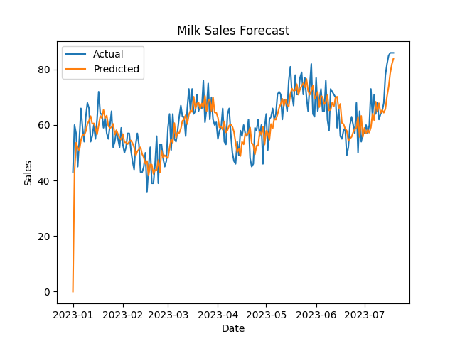

# 🛒 Retail Sales Forecasting & Inventory Optimization System

> 🚀 End-to-End Retail Analytics Project using Machine Learning, Time-Series Forecasting, and Business Intelligence Dashboard

---

## 📌 Overview

This project is a **complete retail analytics system** designed to simulate how modern retail companies forecast demand, optimize inventory, and make data-driven decisions.

It combines **machine learning + business logic + dashboarding** to solve real-world retail problems.

---

## 🎯 Business Problem

Retail businesses constantly struggle with:

- ❌ **Stockouts** → Lost revenue & poor customer experience  
- ❌ **Overstocking** → High storage & capital costs  
- ❌ **Uncertain demand patterns**  

### ✅ Solution

This system provides:

- 📈 Accurate **sales forecasting**  
- 📦 Smart **inventory optimization**  
- 📊 Actionable **business insights**  

---

## 🚀 Key Features

### 📊 Demand Forecasting
- Machine Learning model (**Random Forest**)  
- Time-based feature engineering  
- 7-day future demand prediction  

### 📦 Inventory Optimization
- Safety Stock calculation  
- Reorder Point logic  
- Inventory classification:
  - 🔴 LOW (Reorder required)
  - 🟢 OK
  - 🟡 OVERSTOCK  

### 🏬 Multi-Store Simulation
- Multiple stores  
- Multiple products  
- Realistic demand variation  

### 💰 Business KPIs
- Revenue tracking  
- Profit estimation  
- Sales performance metrics  

### ⚠️ Anomaly Detection
- Detect unusual sales spikes/drops  

### 📈 Interactive Dashboard
- Built using **Streamlit**  
- Filters (Store, Product, Date)  
- KPI cards  
- Forecast visualization  
- Download reports  
- Login system  

---

## 🏢 Industry Relevance

Similar systems are used by:

- 🛍 E-commerce: Amazon, Flipkart  
- 🏬 Retail Chains: Walmart, Reliance Retail  
- 🚚 Supply Chain & Logistics Companies  

---

## 🛠️ Tech Stack

| Category        | Tools Used                          |
|----------------|-----------------------------------|
| Language        | Python                            |
| Data Processing | Pandas, NumPy                     |
| ML Model        | Scikit-learn (Random Forest)      |
| Visualization   | Matplotlib, Plotly                |
| Dashboard       | Streamlit                         |

---

## 📂 Project Structure

```
retail-project/
│
├── data/
│   └── raw/
│       └── sales.csv
│
├── src/
│   ├── data_preprocessing.py
│   ├── feature_engineering.py
│   ├── model.py
│   └── inventory.py
│
├── outputs/
│   ├── final_output.csv
│   └── future_forecast.csv
│
├── images/
│   ├── dashboard.png
│   ├── forecast.png
│   └── inventory.png
│
├── main.py
├── app.py
├── requirements.txt
└── README.md
```

---

## ⚙️ Installation

```bash
git clone https://github.com/YOUR_USERNAME/retail-sales-forecasting-inventory-optimization.git
cd retail-sales-forecasting-inventory-optimization

python -m venv venv
venv\Scripts\activate

pip install -r requirements.txt
```

---

## ▶️ Run the Project

```bash
python main.py
streamlit run app.py
```

---

## 📊 System Output

The system provides:

- 📈 Sales trend visualization  
- 🔮 Future demand forecast  
- 📦 Inventory recommendations  
- 💰 Business KPIs dashboard  

---

## 📸 Dashboard Preview



---

## 📈 Sample Insights

- Total Revenue: ₹50,000+  
- Profit: ₹10,000+  
- Inventory Alert: LOW → Reorder required  
- Demand Trend: Increasing 📈  

---

## 🔮 Future Enhancements

- Multi-region forecasting  
- Price elasticity analysis  
- Promotion impact modeling  
- Real-time data integration  
- Cloud deployment (AWS / Streamlit Cloud)  

---

## 🎓 Learning Outcomes

- Time-series forecasting  
- Inventory optimization strategies  
- Feature engineering  
- Business analytics thinking  
- Dashboard development  
- End-to-end project execution  

---

## 👨‍💻 Author

**Dhananjay Bhaskar**

---

## ⭐ Support

If you found this project useful, consider giving it a ⭐ on GitHub!
